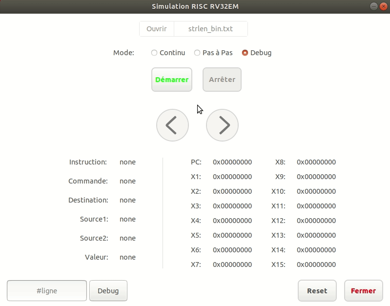

## Simulation RISC-V RV32EM

Programme qui permet de simuler un processeur RISC-V RV32EM à partir
d'un fichier qui contient les instructions.

### Démontration de son utilisation
 **1.  Première impression/Ouvir et selectionner un fichier d'instructions**
 

* À l'ouverture, seul le bouton fermer et le bouton ouvrir répertoire sont accessibles.
* Après avoir sélectionné le fichier d'instructions, une barre de chargement apparait.
    * Il est possible à partir de se moment de "Reset" tout l'application et de refaire un selection de fichier d'instructions.
* Ensuite, il va être possible de faire un choix de mode.

  
 
   

 **2.  Les modes de simulation possibles.**

 * Il y a trois modes possibles:
    * le mode continu,
    * le mode pas à pas,
    * le mode debug.

 

   

 **3.  Le mode `CONTINU`.**
     
* Lors du démarrage pour ce mode, on ne peut pas suivre l'évolution des états de registres.

 

   

**4.  Le mode `PAS À PAS`.**

* Il est possible avec les flêches de passer à l'instruction suivante ou à celle précédente.

 

   

 **5.  Le mode `DEBUG`.**

 * Le mode "Debug" c'est le mode PAS À PAS en plus d'avoir l'option de passer à une instruction à une certaine position.

 

    

  **6.  Le bouton "Reset".**

 * Le bouton "Reset" permet de remettre les éléments de l'application à leur par état par défaut.
 Cela permet de refaire un sélection d'un nouveau fichier d'instruction si désiré.

 

   

 ### Travail demandé

1. Les 5 premières instructions du programme `strlen_bin.txt` en mode pas-à-pas suivi du résultat final en mode continu.

 

   

 1. Les 5 premières instructions du programme `fmul_bin.txt` en mode pas-à-pas suivi du résultat final en mode continu.

 ** On ne peut pas faire le mode continu avec ce fichier car le programme rentre dans une boucle infinie. (Il quelques "bug" à règler.)

 

   
 

